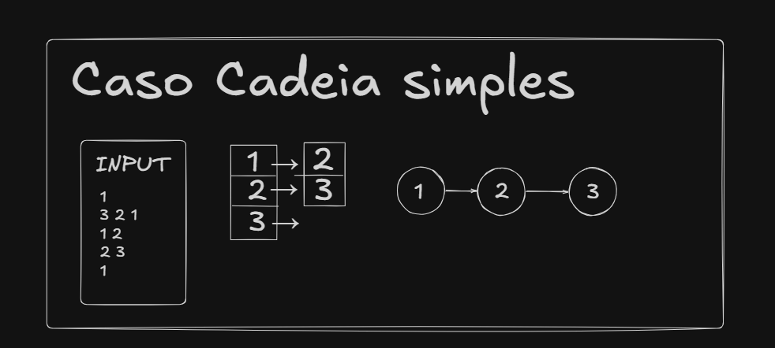
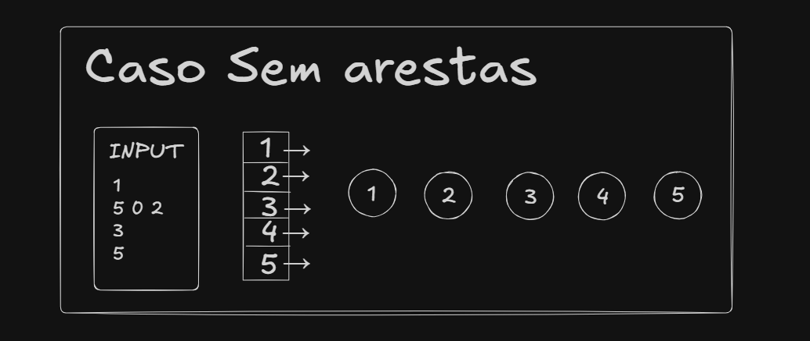
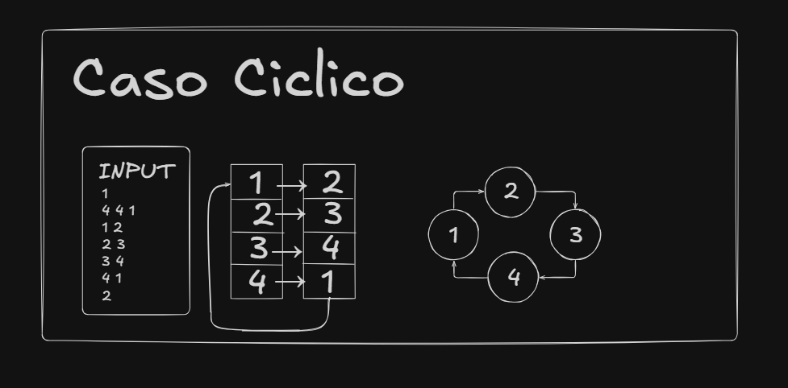

# Caso 1 (Caso simples)
Aqui abordamos a utilização do caso teste de cadeia simples. Na imagem referenciamos a lista de adjacência, a representação em grafos do problema juntamente com uma entrada de exemplo.

# Caso 2 (Caso sem arestas)
Aqui abordamos a utilização do caso teste sem arestas. Na imagem referenciamos a lista de adjacência, a representação em grafos do problema juntamente com uma entrada de exemplo.

# Caso 3 (Caso cíclico)
Na imagem referenciamos a lista de adjacência, a representação em grafos do problema juntamente com uma entrada de exemplo.

